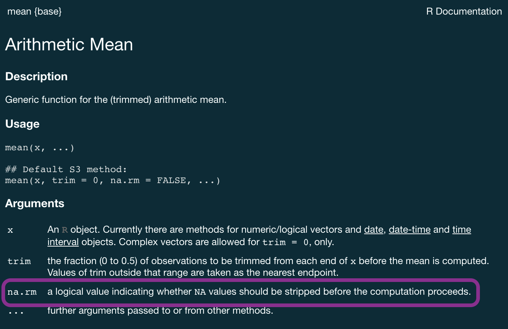
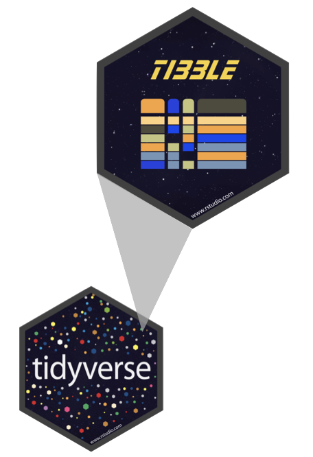

```{r packages, echo=FALSE, message=FALSE, warning=FALSE}
library(tidyverse)
library(DT)
library(scales)
```

# Pourquoi s'intéresser aux types de données ?

## Exemple: Cat lovers

Un sondage a demandé à des gens leur nom et le nombre de chat qu'ils possèdent. Les instructions indiquaient d'entrer le nombre de chats en chiffres. 

<br/>

```{r message=FALSE}
cat_lovers <- read_csv("data/cat-lovers.csv")
```

```{r echo=FALSE}
cat_lovers
```

## Statistique simple...

```{r}
cat_lovers %>%
  summarise(mean_cats = mean(number_of_cats))
```

[Ca ne marche pas...]{.heavy-red}

## Pourquoi ?

```{r eval=FALSE}
?mean
```



## Et maintenant ?

```{r}
cat_lovers %>%
  summarise(mean_cats = mean(number_of_cats, na.rm = TRUE))
```

[Toujours pas...]{.heavy-red}

## Regardons les données


```{r}
glimpse(cat_lovers)
```

## Il suffit de convertir !

```{r}
cat_lovers %>%
  mutate(
    number_of_cats = as.numeric(number_of_cats)
  ) %>%
  summarise(mean_cats = mean(number_of_cats, na.rm = TRUE))
```
[Ok mais ...]{.heavy-red}

```{r echo=FALSE, warning=TRUE, message=FALSE, results='hide'}
cat_lovers %>%
  mutate(
    number_of_cats = as.numeric(number_of_cats)
  )
```

## Regardons cela de plus près...

:::{.small}
```{r echo=FALSE}
cat_lovers %>%
  datatable()
```
:::

## Respecter les types de données

```{r}
cat_lovers %>%
  mutate(
    number_of_cats = case_when(
      name == "Ginger Clark" ~ "2",
      name == "Doug Bass"    ~ "3",
      TRUE                   ~ number_of_cats
      ),
    number_of_cats = as.numeric(number_of_cats)
    ) %>%
  summarise(mean_cats = mean(number_of_cats))
```

## Enregistrer

```{r}
#| code-line-numbers: "1"

cat_lovers <- cat_lovers %>%
  mutate(
    number_of_cats = case_when(
      name == "Ginger Clark" ~ "2",
      name == "Doug Bass"    ~ "3",
      TRUE                   ~ number_of_cats
      ),
    number_of_cats = as.numeric(number_of_cats)
    )
```

## Morale

  - Si vos données ne se comportent pas comme vous l'attendez, il se peut qu'il s'agisse d'un probplème de type de données.
  - Explorez et investiguez vos données, appliquez les modifications, *sauvegardez vos données*, vivez heureux
  

# Types de données

## Types de données dans R

  - [logical]{.heavy-red}
  - [double]{.heavy-red}
  - [integer]{.heavy-red}
  - [character]{.heavy-red}
  -  Il y a en d'autres mais nous les utiliserons peu
  
## Logical et character


[logical]{.heavy-red} - Valeurs booléennes [TRUE]{.gray-mono} et [FALSE]{.gray-mono}

```{r}
typeof(TRUE)
```

<br/>

[character]{.heavy-red} - Texte

```{r}
typeof("Hello")
```


## Double et integer

[double]{.heavy-red} - Nombres à virgule flottante (type par défaut pour les nombres)

```{r}
typeof(1.5)
```

```{r}
typeof(7)
```

<br/>

[integer]{.heavy-red} - Nombres entiers (indiqué par un [L]{.gray-mono})

```{r}
typeof(1L)
```

```{r}
typeof(1:3)
```


## Concatenation

Des vecteurs peuvent être construits à l'aide de la fonction [c()]{.gray-mono}

<br/>

```{r}
c(1, 2, 3)
c("Hello", "World!")
c(c("hi", "hello"), c("bye", "jello"))
```

## Conversion

... intentionnelle

:::columns
:::{.column width="50%" .fragment}

```{r}
x <- 1:3
x
typeof(x)
```
:::

:::{.column width="50%" .fragment}
```{r}
y <- as.character(x)
y
typeof(y)
```
:::
:::

<br/>

:::columns
:::{.column width="50%" .fragment}

```{r}
x <- c(TRUE, FALSE)
x
typeof(x)
```
:::

:::{.column width="50%" .fragment}
```{r}
y <- as.numeric(x)
y
typeof(y)
```
:::
:::

## Conversion

... accidentelle

R va faire les conversions sans se poser de questions, surtout quand on mets différentes choses dans un même vecteur.

:::columns
:::{.column width="50%" .fragment}

```{r}
c(1, "Hello")
c(FALSE, 3L)
```
:::

:::{.column width="50%" .fragment}
```{r}
c(1.2, 3L)
c(2L, "two")
```
:::
:::

## Conversion

  - [Explicite]{.heavy-red} - Utilisez les fonctions [as.*()]{.gray-mono}
    - [as.logical()]{.gray-mono}
    - [as.numeric()]{.gray-mono}
    - [as.integer()]{.gray-mono}
    - [as.character()]{.gray-mono}
    - [as.double()]{.gray-mono}
  
  - [Implicite]{.heavy-red} - R va faire les conversions pour vous, soyez vigilant
  

# Cas spéciaux

## Cas spéciaux

  - [NA]{.gray-mono} - Valeur manquante
  - [Inf]{.gray-mono} - Infini
  - [NaN]{.gray-mono} - Not a Number

<br/>

:::columns
:::{.column width="50%" .fragment}

```{r}
# division par zéro -> Inf
7/0
```
:::

:::{.column width="50%" .fragment}
```{r}
-1/0
```
:::
:::

<br/>

:::fragment
```{r}
Inf - Inf
```
:::

## `NA`

```{r}
x <- c(1, 2, 3, 4, NA)
```

```{r}
mean(x)
mean(x, na.rm = TRUE)
summary(x)
```

## `NA`

Les `NA` sont utilisés par R pour représenter des valeurs manquantes. Ils sont de type logique.

<br/>

```{r}
typeof(NA)
```

<br/>

:::columns
:::{.column width="50%" .fragment}

```{r}
# TRUE or NA
TRUE | NA
```
:::

:::{.column width="50%" .fragment}

```{r}
# FALSE or NA
FALSE | NA
```

:::
:::

# Classes de données

## Classes de données

Nous avons parlé des *types* des données et nous allons maintenant parler des *classes* des données:

  - Vecteurs sont comme des briques LEGO
  - On les colle ensemble pour construire des structures plus compliquées, notamment des *représentations de données*

Par exemples:

  - [factor]{.heavy-red}
  - [date]{.heavy-red}
  - [data frame]{.heavy-red}  


## `factor`

Les facteurs sont utilisés pour gérer les variables catégorielles, c'est-à-dire les variables qui ont un ensemble fixe et connu de valeurs possibles.

<br/>

```{r}
x <- factor(c("BS", "MS", "PhD", "MS"))
x
```

<br/>


:::columns
:::{.column width="50%" .fragment}

```{r}
typeof(x)
```
:::

:::{.column width="50%" .fragment}

```{r}
class(x)
```

:::
:::

## `factor`

Pour chaque facteur on a:

  - [levels]{.gray-mono} - Les valeurs possibles
  - [labels]{.gray-mono} - Les étiquettes associées aux valeurs
  
<br/>

```{r}
glimpse(x)
as.integer(x)
```

## Dates

```{r}
y <- as.Date("2024-01-01")
y
typeof(y)
class(y)
```

## Dates

Les dates sont en réalité un entier (le nombre de jours depuis l'origine, 1 Jan 1970) et un entier (l'origine) collés ensemble

```{r}
as.integer(y)
as.integer(y) / 365 
```


## Data frames

Les data frames sont des structures de données qui sont comme des vecteurs de différentes classes.

```{r}
df <- data.frame(x = 1:2, y = 3:4)
df
```

:::columns
:::{.column width="50%" .fragment}

```{r}
typeof(df)
```
:::

:::{.column width="50%" .fragment}

```{r}
class(df)
```

:::
:::

## Listes

Les listes sont des conteneurs génériques pour des vecteurs de n'importe quel type.

```{r}
l <- list(
  x = 1:4,
  y = c("hi", "hello", "jello"),
  z = c(TRUE, FALSE)
)
l
```

## Listes et data frames

  - Un data frame est une liste spéciale contenant des vecteurs de longueur égale
  - Un `tibble` est un data frame du Tidyverse

```{r}
df

df %>%
  as_tibble()

df %>%
  as_tibble() %>%
  class()
```

## Tibbles

Les Tibbles sont des data frames modernes. Ils sont adaptés au tidyverse (en pratique, toutes les fonctions du tidyverse retournent des `tibbles` au lieu de `data.frame`).

:::columns
:::{.column width="35%"}

{height="500px"}
:::
::: {.column width="65%"}

  - Les tibbles ont un affichage limité, adapté à la console
  - Il est possible d'accéder à une colonne à l'aide des double crochets (`df[["x"]]`) en plus du `$` (`df$x`). Il est ainsi possible d'utiliser le numéro de colonne au lieu du nom (`df[[1]]`)
  - Les tibbles fournissent également plus d'indications lorsque quelque chose ne va pas (messages de *warnings*).
:::
:::

# Travailler avec des facteurs

```{r include=FALSE}
cat_lovers <- read_csv("data/cat-lovers.csv")
```

## Exemple: Cat lovers

Nous commençons avec un data frame avec des caractères

```{r}
glimpse(cat_lovers)
```


## Plotting

Au moment de faire un graphique, R va faire une conversion de type

Si on lui demande de plotter des catégories, il va créer des facteurs

```{r out.width="60%"}
ggplot(cat_lovers, mapping = aes(x = handedness)) +
  geom_bar()
```

Les facteurs sont ordonnées par ordre alphabétique par défaut

## On peut manipuler les facteurs avec `forcats`

```{r out.width="55%"}
#| code-line-numbers: "2"
cat_lovers %>%
  mutate(handedness = fct_infreq(handedness)) %>%
  ggplot(mapping = aes(x = handedness)) +
  geom_bar()
```

## La grammaire de la manipulation de données

Basé sur des fonctions qui correspondent à des verbes permettant de manipuler des dataframes.

:::columns
:::{.column width="35%"}

{height="60%"}
:::
::: {.column width="65%"}

  - Les facteurs sont utiles lorsque vous avez des données catégorielles et que vous voulez remplacer l'ordre des vecteurs de caractères pour améliorer l'affichage
  - Le package **forcats** fournit une suite d'outils utiles qui résolvent des problèmes courants avec les facteurs
:::
:::

## Les fonctions de `forcats`

`focats` possède plusieurs fonctions pour manipuler les facteurs:

  - [fct_reorder()]{.gray-mono} - Réordonne les niveaux d'un facteur en fonction d'une autre variable
  - [fct_relevel()]{.gray-mono} - Réordonne les niveaux d'un facteur
  - [fct_infreq()]{.gray-mono} - Réordonne les niveaux d'un facteur en fonction de leur fréquence
  - [fct_lump()]{.gray-mono} - Regroupe les niveaux d'un facteur en "autres"
  - [fct_explicit_na()]{.gray-mono} - Ajoute un niveau pour les valeurs manquantes

## Exemple: starwars

```{r}
starwars %>%
  ggplot(aes(y = hair_color)) + 
  geom_bar()
```

## Ordre selon la fréquence : `fct_infreq()`

```{r}
starwars %>%
  mutate(
    hair_color = fct_infreq(hair_color)
  ) %>%
  ggplot(aes(y = hair_color)) + 
  geom_bar()
```

## Regroupement de facteurs

Utile quand on a beaucoup de niveaux

```{r}
starwars %>%
  count(skin_color, sort = TRUE)
```

... 31 niveaux dans cet exemple !

## Regroupement de facteurs  : `fct_lump()`

```{r}
starwars %>%
  mutate(skin_color = fct_lump(skin_color, n = 5)) %>%
  count(skin_color, sort = TRUE)
```

## Regroupement de facteurs


Regardons maintenant la masse moyenne selon la couleur des yeux:

```{r}
starwars %>%
  mutate(eye_color = fct_lump(eye_color, n = 6)) %>%
  group_by(eye_color) %>%
  summarise(mean_mass = mean(mass, na.rm = TRUE)) %>%
  ggplot(aes(x = eye_color, y = mean_mass)) +
  geom_col()
```

## Regroupement et changement d'ordre !

Nous allons maintenant regrouper les couleurs des yeux et les ordonner selon la masse moyenne

```{r}
#| code-line-numbers: "5"
starwars %>%
  mutate(eye_color = fct_lump(eye_color, n = 6)) %>%
  group_by(eye_color) %>%
  summarise(mean_mass = mean(mass, na.rm = TRUE)) %>%
  mutate(eye_color = fct_reorder(eye_color, mean_mass)) %>%
  ggplot(aes(x = eye_color, y = mean_mass)) +
  geom_col()
```


## Exemple: Hotels

```{r echo=FALSE, out.width="90%", fig.asp=0.4}

hotels <- readr::read_csv("data/hotels.csv")

hotels %>%
  group_by(hotel, arrival_date_month) %>%   # group by type d'hotel et mois d'arrivée
  summarise(mean_adr = mean(adr)) %>%       # calcul de l'ADR moyen pour chaque groupe
  ggplot(aes(
    x = arrival_date_month,
    y = mean_adr,                           # mean_adr sur y-axis
    group = hotel,                          # Groupe les lignes par type
    color = hotel)                          # couleur par type
    ) +
  geom_line() +                             # On veut des lignes
  scale_y_continuous(labels = label_dollar()) +
  theme_minimal() +                         # Utilise le minimal theme
  labs(x = "Arrival month",                 # On met à jour les labels
       y = "Mean ADR (average daily rate)",
       title = "Comparison of resort and city hotel prices across months",
       subtitle = "Resort hotel prices soar in the summer while city hotel prices remain\nrelatively constant throughout the year",
       color = "Hotel type") +
  scale_x_discrete(guide = guide_axis(check.overlap = TRUE)) # On s'assure que les labels ne se chevauchent pas
```

## Exemple: Hotels

```{r arrival-month, echo=FALSE, out.width="90%", fig.asp=0.4}
#| code-line-numbers: "3"
hotels <- readr::read_csv("data/hotels.csv")

hotels %>%
  mutate(arrival_date_month = fct_relevel(arrival_date_month, month.name)) %>% # On réordonne les mois
  group_by(hotel, arrival_date_month) %>%   # group by type d'hotel et mois d'arrivée
  summarise(mean_adr = mean(adr)) %>%       # calcul de l'ADR moyen pour chaque groupe
  ggplot(aes(
    x = arrival_date_month,
    y = mean_adr,                           # mean_adr sur y-axis
    group = hotel,                          # Groupe les lignes par type
    color = hotel)                          # couleur par type
    ) +
  geom_line() +                             # On veut des lignes
  scale_y_continuous(labels = label_dollar()) +
  theme_minimal() +                         # Utilise le minimal theme
  labs(x = "Arrival month",                 # On met à jour les labels
       y = "Mean ADR (average daily rate)",
       title = "Comparison of resort and city hotel prices across months",
       subtitle = "Resort hotel prices soar in the summer while city hotel prices remain\nrelatively constant throughout the year",
       color = "Hotel type") +
  scale_x_discrete(guide = guide_axis(check.overlap = TRUE)) # On s'assure que les labels ne se chevauchent pas
```


## Choix manuel de l'ordre : `fct_relevel()`


La variable `month.name` est une variable intégrée dans R qui contient les noms des mois en anglais et dans le bon ordre.


:::{.long-sourcecode}
```{r ref.label="arrival-month", eval=FALSE}
#| code-line-numbers: "|4"
```
:::

## Renommer les niveaux : `fct_recode()`

Si on veut simplement renommer les niveaux, on peut utiliser `fct_recode()`


```{r}
cat_lovers %>%
  mutate(handedness = fct_recode(handedness, gaucher = "left", droitier = "right")) %>%
  mutate(handedness = fct_infreq(handedness)) %>%
  ggplot(mapping = aes(x = handedness)) +
  geom_bar()
```


# Travailler avec les dates


## Dates

:::columns
:::{.column width="35%"}

{height="60%"}
:::
::: {.column width="65%"}

- **lubridate** est un package tidyverse-friendly qui facilite la manipulation des dates
- Il ne fait pas partie du coeur tidyverse, donc il doit être installé avec `install.packages("lubridate")` mais il n'est pas chargé avec lui, et doit être explicitement chargé avec `library(lubridate)`.

  - ...
:::
:::

## Exemple des hotels

[Calculer et visualiser le nombre de réservations à une date d'arrivée donnée]{.question}

Nous allons voir les bases mais travailler avec des dates peut s'avérer complexe mais cela peut apporter beaucoup à une analyse.


:::{.small}
```{r echo=FALSE}
hotels %>%
  slice_head(n=3) %>%
  datatable()
```
:::

## Étape 1 - Construire la date

```{r output.lines=7}
library(glue) # glue permet de coller des éléments ensemble

hotels %>%
  mutate(
    arrival_date = glue("{arrival_date_year} {arrival_date_month} {arrival_date_day_of_month}")
    ) %>% 
  relocate(arrival_date) # pour afficher la nouvelle colonne à gauche
```

## Étape 2 - Compter les réservations par dates

```{r}
hotels %>%
  mutate(arrival_date = glue("{arrival_date_year} {arrival_date_month} {arrival_date_day_of_month}")) %>%
  count(arrival_date)
```

## Étape 4 - Visualiser

```{r}
hotels %>%
  mutate(arrival_date = glue("{arrival_date_year} {arrival_date_month} {arrival_date_day_of_month}")) %>%
  count(arrival_date) %>%
  ggplot(aes(x = arrival_date, y = n, group = 1)) +
  geom_line()
```

[Quel est le problème ici ?]{.question}

## Étape 1 - Construire la date (comme une date)

```{r output.lines=7}
library(lubridate) # pour les dates

hotels %>%
  mutate(
    arrival_date = ymd(glue("{arrival_date_year} {arrival_date_month} {arrival_date_day_of_month}"))
    ) %>% 
  relocate(arrival_date)
```

## Étape 2 - Compter les réservations par dates

```{r}
hotels %>%
  mutate(arrival_date = ymd(glue("{arrival_date_year} {arrival_date_month} {arrival_date_day_of_month}"))) %>% 
  count(arrival_date)
```

## Étape 3a - Visualiser

```{r out.width="80%", fig.asp = 0.4}
hotels %>%
  mutate(arrival_date = ymd(glue("{arrival_date_year} {arrival_date_month} {arrival_date_day_of_month}"))) %>% 
  count(arrival_date) %>%
  ggplot(aes(x = arrival_date, y = n, group = 1)) +
  geom_line()
```

## Étape 3b - Visualiser avec une courbe

```{r out.width="80%", fig.asp = 0.4, message = FALSE}
hotels %>%
  mutate(arrival_date = ymd(glue("{arrival_date_year} {arrival_date_month} {arrival_date_day_of_month}"))) %>% 
  count(arrival_date) %>%
  ggplot(aes(x = arrival_date, y = n, group = 1)) +
  geom_smooth() #<<
```
