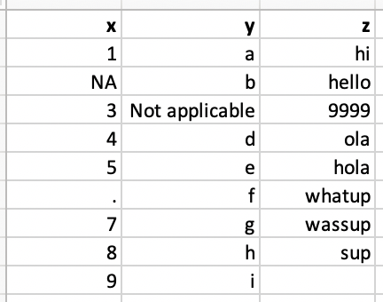
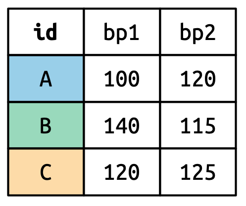
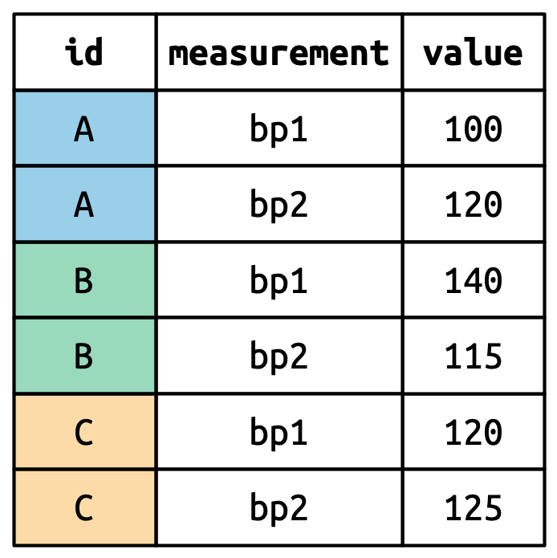

```{r packages, echo=FALSE, message=FALSE, warning=FALSE}
library(tidyverse)
library(janitor)
```

# Importation de données

## Présentations

:::columns
:::column


:::

:::column


:::
:::

## `readr`

  - [read_csv()]{.gray-mono} - fichiers CSV
    - CSV: comma-separated values - valeurs séparées par des virgules
  - [read_csv2()]{.gray-mono} - fichiers CSV mais où le séparateur est un point-virgule
    - Commun dans les pays où le séparateur décimal est la virgule
  - [read_tsv()]{.gray-mono} - fichiers TSV
    - TSV: tab-separated values - valeurs séparées par des tabulations
  - [read_delim()]{.gray-mono} - fichiers avec un délimiteur spécifique
    - On peut spécifier le délimiteur avec l'argument `delim`
  - ...

## `readxl`

  - [read_excel()]{.gray-mono} - Permet de lire des fichiers Excel

## Lecture de fichiers

```{r}
nobel <- read_csv(file = "data/nobel.csv")
nobel
```

## Noms des varaibles

Le nom des variables n'est pas toujours optimal.

```{r}
edibnb_badnames <- read_csv("data/edibnb-badnames.csv")
names(edibnb_badnames)
```

Et R n'aime pas les noms de variables avec des espaces.

```{r error=TRUE}
ggplot(edibnb_badnames, aes(x = Number of bathrooms, y = Price)) +
  geom_point()
```

## Option 1: Spécifier les noms des variables à l'importation

```{r}
edibnb_col_names <- read_csv("data/edibnb-badnames.csv",
                             col_names = c("id", "price", 
                                           "neighbourhood", "accommodates",
                                           "bathroom", "bedroom", 
                                           "bed", "review_scores_rating", 
                                           "n_reviews", "url"))
names(edibnb_col_names)
```

## Option 2: Utiliser le format snake_case

  - Les espaces sont remplacés par des underscores
  - Les lettres sont en minuscules

Nous pouvons utiliser la fonction `janitor::clean_names()`

```{r}
edibnb_clean_names <- read_csv("data/edibnb-badnames.csv") %>%
  janitor::clean_names()
names(edibnb_clean_names)
```


## Gestion des types de données

:::columns
:::column


:::

:::column

```{r}
read_csv("data/df-na.csv")
```
:::
:::

## Spécification des NAs

```{r}
read_csv("data/df-na.csv", 
         na = c("", "NA", ".", "9999", "Not applicable"))
```


## Spécification des types de chaque colonne

```{r}
read_csv("data/df-na.csv", col_types = list(col_double(), 
                                            col_character(), 
                                            col_character()))
```

## Les types de colonnes

:::{.small}
[**Fonction**]{.heavy-red}       | [**Types de données**]{.heavy-red}
------------------ | -------------
`col_character()`  | Chaine de caractères
`col_date()`       | Date
`col_datetime()`   | POSIXct (date-time)
`col_double()`     | Double (numeric)
`col_factor()`     | Factor
`col_guess()`      | Laisse readr deviner ( par défaut)
`col_integer()`    | Entier
`col_logical()`    | Logique
`col_number()`     | Nombre et texte mélangés
`col_numeric()`    | Double ou entier
`col_skip()`       | Ne pas lire la colonne
`col_time()`       | Temps
:::

# Jointure de données

## Kesako

Lorsque nous avons des données dans plusieurs fichiers/tables, il est souvent nécessaire de les combiner.

## Données: Les femmes dans la science

Nous avons des informations sur 10 femmes qui ont changé le monde. Les informations sont réparties dans trois fichiers:

  - `professions.csv`: Information sur la profession de chacune
  - `dates.csv`: date de naissance et de décès de chacune
  - `works.csv`: Ce qu'elles ont fait pour changer le monde

::: aside
Source: [Meet 10 Women in Science Who Changed the World](https://www.discovermagazine.com/the-sciences/meet-10-women-in-science-who-changed-the-world)
:::

## `professions.csv`

```{r}
professions <- read_csv("data/scientists/professions.csv")
professions
```

## `dates.csv`

```{r}
dates <- read_csv("data/scientists/dates.csv")
dates
```

## `works.csv`

```{r}
works <- read_csv("data/scientists/works.csv")
works
```

## Ce que nous voulons comme output

```{r echo=FALSE}
scientists <- professions %>%
  left_join(dates, by = "name") %>%
  left_join(works, by = "name")
scientists
```

## Types de jointures

  - `left_join()`: Retourne toutes les lignes de la première table et les lignes correspondantes de la deuxième table
  - `right_join()`: Retourne toutes les lignes de la deuxième table et les lignes correspondantes de la première table
  - `inner_join()`: Retourne les lignes qui ont une correspondance dans les deux tables
  - `full_join()`: Retourne toutes les lignes des deux tables
  - `semi_join()`: Retourne toutes les lignes de la première table qui ont une correspondance dans la deuxième table
  - `anti_join()`: Retourne toutes les lignes de la première table qui n'ont pas de correspondance dans la deuxième table

## Pour l'exemple...

:::columns
:::column

```{r echo=FALSE}
x <- tibble(
  id = c(1, 2, 3),
  value_x = c("x1", "x2", "x3")
  )
```
```{r}
x
```
:::

::: column
```{r echo=FALSE}
y <- tibble(
  id = c(1, 2, 4),
  value_y = c("y1", "y2", "y4")
  )
```
```{r}
y
```
:::
:::

## `left_join()`

:::columns
:::column

](figs/left-join.gif){style="background-color: #FDF6E3"}
:::

:::column

```{r}
left_join(x, y)
```
:::
:::

## `left_join()`

```{r}
professions %>%
  left_join(dates)
```


## `right_join()`

:::columns
:::column

](figs/right-join.gif){style="background-color: #FDF6E3"}
:::

:::column

```{r}
right_join(x, y)
```
:::
:::

## `right_join()`

```{r}
professions %>%
  right_join(dates)
```

## `full_join()`

:::columns
:::column

](figs/full-join.gif){style="background-color: #FDF6E3"}
:::

:::column

```{r}
full_join(x, y)
```
:::
:::

## `full_join()`

```{r}
professions %>%
  full_join(works)
```


## `inner_join()`

:::columns
:::column

](figs/inner-join.gif){style="background-color: #FDF6E3"}
:::

:::column

```{r}
inner_join(x, y)
```
:::
:::

## `inner_join()`

```{r}
professions %>%
  inner_join(dates)
```

## Si on reprend...

```{r}
professions %>%
  left_join(dates) %>%
  left_join(works)
```


# Tidy data

## Tidy data
:::{.quote}
Happy families are all alike; every unhappy family is unhappy in its own way.
-- Leo Tolstoy
:::

[Qu'est ce que des données Tidy ?]{.heavy-red}

  - Chaque variable est une colonne
  - Chaque observation est une ligne
  - Chaque valeur est une cellule

## Tidy data

![[@wickhamDataScience2023, chap. 5]](figs/tidy-data.png)

# Exemples

##
:::{.question}
En quoi ces données ne sont pas tidy ?
:::

](figs/hyperwar-airplanes-on-hand.png)

##
:::{.question}
En quoi ces données ne sont pas tidy ?
:::

](figs/hiv-est-prevalence-15-49.png)

##
:::{.question}
En quoi ces données ne sont pas tidy ?
:::

](figs/us-general-economic-characteristic-acs-2017.png)

# Tidying data

```{r include=FALSE}
customers <- read_csv("data/customers.csv")
prices <- read_csv("data/prices.csv")
```

## Ce qu'on a...

```{r echo=FALSE}
customers
```

## Ce qu'on veut...

```{r echo=FALSE}
customers %>%
  pivot_longer(cols = item_1:item_3, names_to = "item_no", values_to = "item")
```

## Pour Tidyer: Tidyr

:::columns
:::{.column width="35%"}

{height="60%"}
:::
::: {.column width="65%"}

Tidyr permet de transformer les données pour les Tidy :

  - Faire pivoter les données
  - Séparer ou combiner des colonnes
  - Imbriquer/Désimbriquer des colonnes
  - Préciser commenter traiter les `NA`

:::
:::

# Pivoter les données

## 


## Wide vs Long

:::columns
:::column

Forme large :


:::

:::column
Forme longue :


:::
:::

::: Aside
Source: [@wickhamDataScience2023, chap. 5]
:::

## Wide vs Long

:::columns
:::column

[Wide]{.heavy-red}

Plus de colonnes

```{r echo=FALSE}
customers
```
:::

::: column

[Long]{.heavy-red}

Plus de lignes

```{r echo=FALSE}
customers %>%
  pivot_longer(cols = item_1:item_3, names_to = "item_no", values_to = "item")
```
:::
:::

## `pivot_longer()`

:::columns
:::column

  - [data]{.gray-mono} : Comme d'habitude
  - [cols]{.gray-mono} : Colonne à pivoter
  - [names_to]{.gray-mono} : Nom de la colonne où les variables vont être envoyées
  - [values_to]{.gray-mono} : Nom de la colonne où les valeurs vont être envoyées

:::

:::column

```
pivot_longer(
  data, 
  cols, 
  names_to = "name", 
  values_to = "value"
  )

```
:::
:::

## Customer $\rightarrow$ purchases

```{r}
purchases <- customers %>%
  pivot_longer(
    cols = item_1:item_3,  # variables item_1 à item_3
    names_to = "item_no",  # Noms des colonnes -> dans une nouvelle colonne item_no
    values_to = "item"     # valeurs pour chaque colonne -> dans une nouvelle colonne item
    )

purchases
```

## `pivot_wider()`

:::columns
:::column

  - [data]{.gray-mono} : Comme d'habitude
  - [names_from]{.gray-mono} : Colonne contenant les noms de colonnes
  - [values_from]{.gray-mono} : Colonne contenant les valeurs

:::

:::column

```{r}
purchases %>%
  pivot_wider(
    names_from = item_no,
    values_from = item
  )

```
:::
:::


## Références
:::{#refs}
:::