# Visualisation des données

:::{.quote}
"The purpose of visualization is insight, not pictures"
- Ben Shneiderman
:::

## DataViz
[Communiquer]{.heavy-red}

  - Transmettre de l’information aux autres

[Explorer]{.heavy-red}

  - Détecter des régularités, relations ou anomalies

[Raisonner]{.heavy-red}

- Comprendre et réfléchir sur les données
- Tester des hypothèses par une mise en perspectives des observations/faits pertinents

[Mémoriser]{.heavy-red}
- Regrouper des informations non homogènes sur un support visuel


## Définition

:::{.quote}
"La représentation graphique fait partie des systèmes de signes que l’homme a construits pour retenir, comprendre et communiquer les observations qui lui sont nécessaires." - Bertin 1967
:::


:::.aside
[@bertinSemiologieGraphiqueDiagrammes2005]
:::

## Infographies
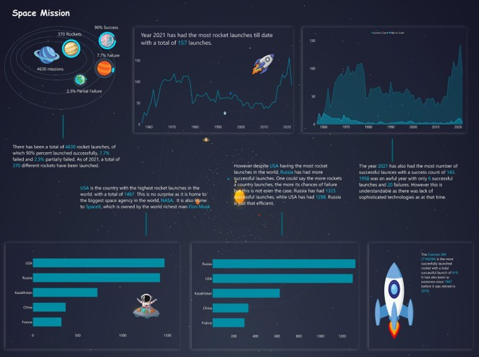
:::.aside
Source: [Visualization of all rocket launches into space](https://www.reddit.com/r/dataisbeautiful/comments/113yf0i/oc_visualization_of_all_rocket_launches_into_space/) by u/archertob
:::

## Imagerie médicale

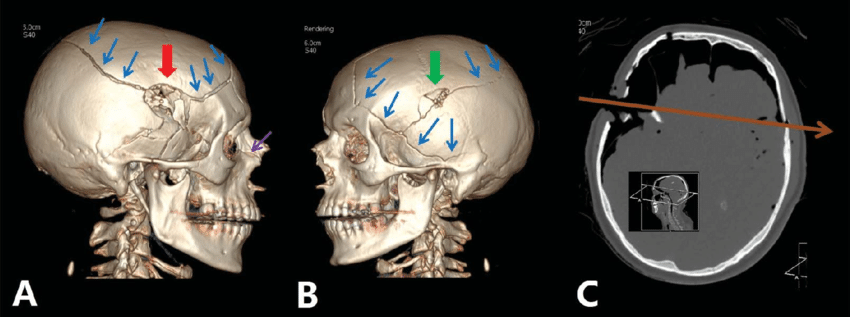

:::.aside
Source: Grabherr, Silke & Egger, Coraline & Vilarino, Raquel & Campana, Lorenzo & Jotterand, Melissa & Dedouit, Fabrice. (2017). Modern post-mortem imaging: an update on recent developments. Forensic sciences research. 2. 52-64. 10.1080/20961790.2017.1330738.
:::


## Perception


## Perception vs cognition

:::{.fragment .fade-up}
[Perception]{.orange}

- Suite à un stimulus sensoriel
- Vue, ouïe, odorat, touché et gout
- Dépend de l’expérience et de ce que l’on attend
:::

:::{.fragment .fade-up}
`Cognition`

- Souvenir, savoir, penser, juger, résoudre des problèmes
:::

:::{.fragment .fade-up}
Peuvent être en conflit:

[Rouge]{style="color:green;"} [Vert]{style="color:orange;"} [Bleu]{style="color:yellow;"} [Orange]{style="color:purple;"} [Violet]{style="color:red;"} [Rose]{style="color:blue;"} [Rouge]{style="color:purple;"} [Vert]{style="color:yellow;"} [Bleu]{style="color:green;"}

## Perception


## Perception


## Perception

:::{.fragment}
::: columns
::: {.column width="60%"}
La vision est sélective:


  - L’œil s’attache à certains endroits
  - Perception pré-attentive

:::
::: {.column width="40%"}
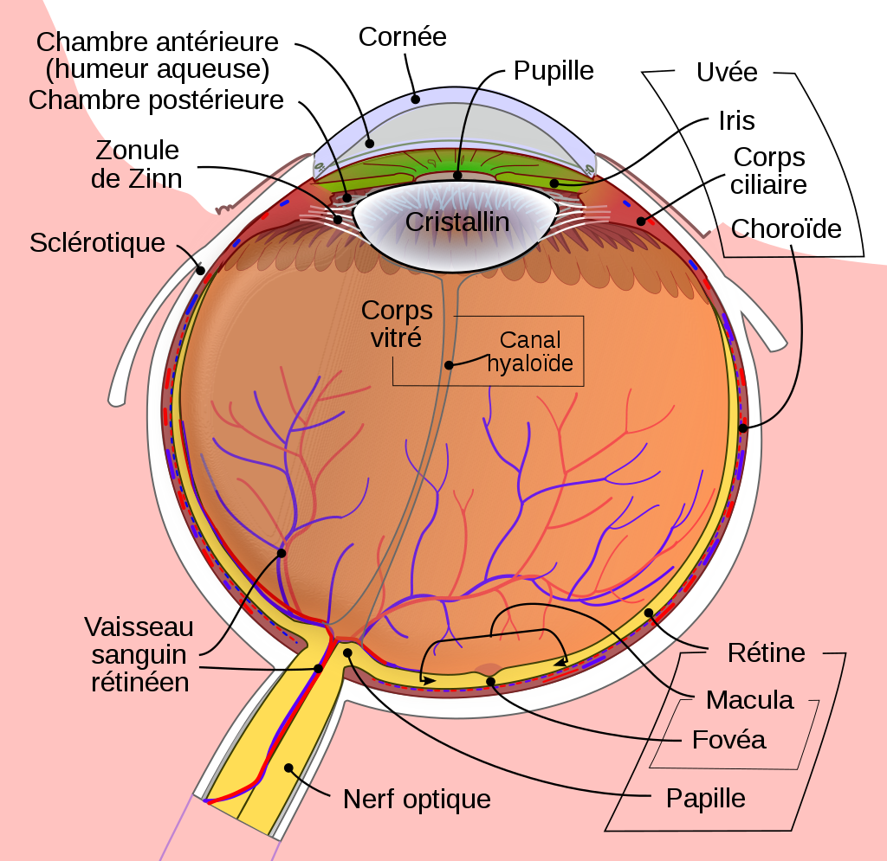
:::
:::
:::

:::{.fragment}
::: columns
::: {.column width="60%"}
La perception de la couleur n’est pas uniforme

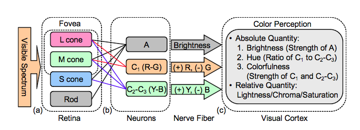{.width="80%"}

:::
::: {.column width="40%"}
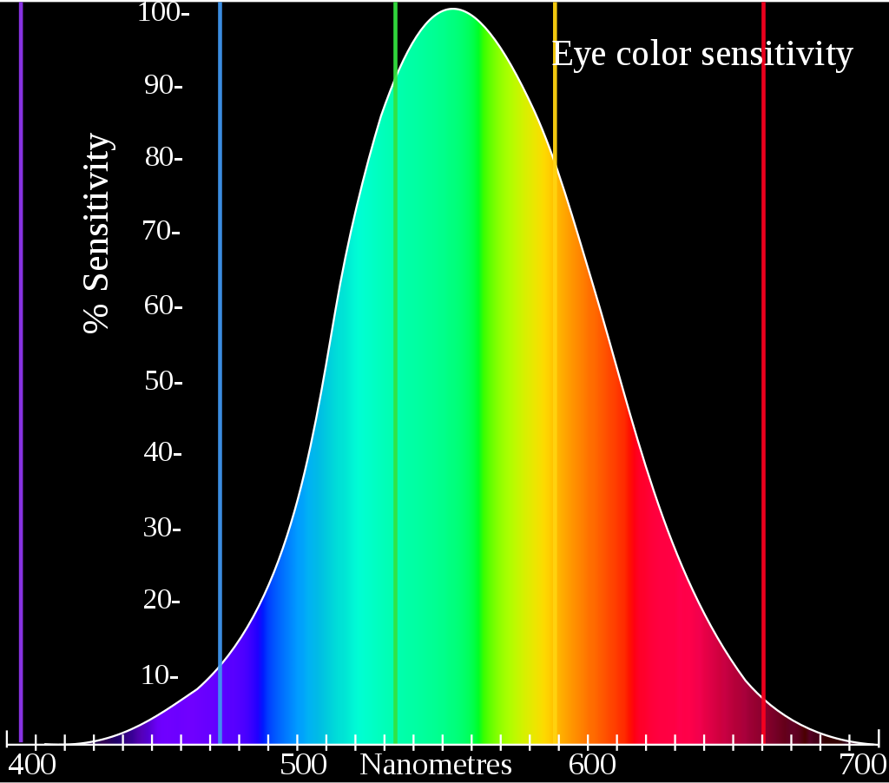{.width="80%"}
:::
:::
:::

:::{.fragment}
[Principes de Gestalt]{.orange} : Nous avons tendance à grouper des éléments

## Perception pré-attentive

:::{.question}
Où est le point rouge ?  
:::

::: columns
::: {.column width="33%"}

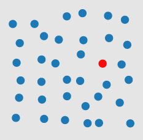

:::
::: {.column width="33%"}

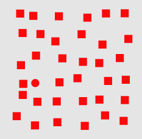

:::
::: {.column width="33%"}

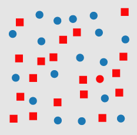
:::
:::

## Perception pré-attentive

::: columns
::: {.column width="60%"}
Aussi appelé « Visual popout »

- Propriétés détectées par le système visuel «primaire»
- Rapide et précis

:::

::: {.column width="40%"}

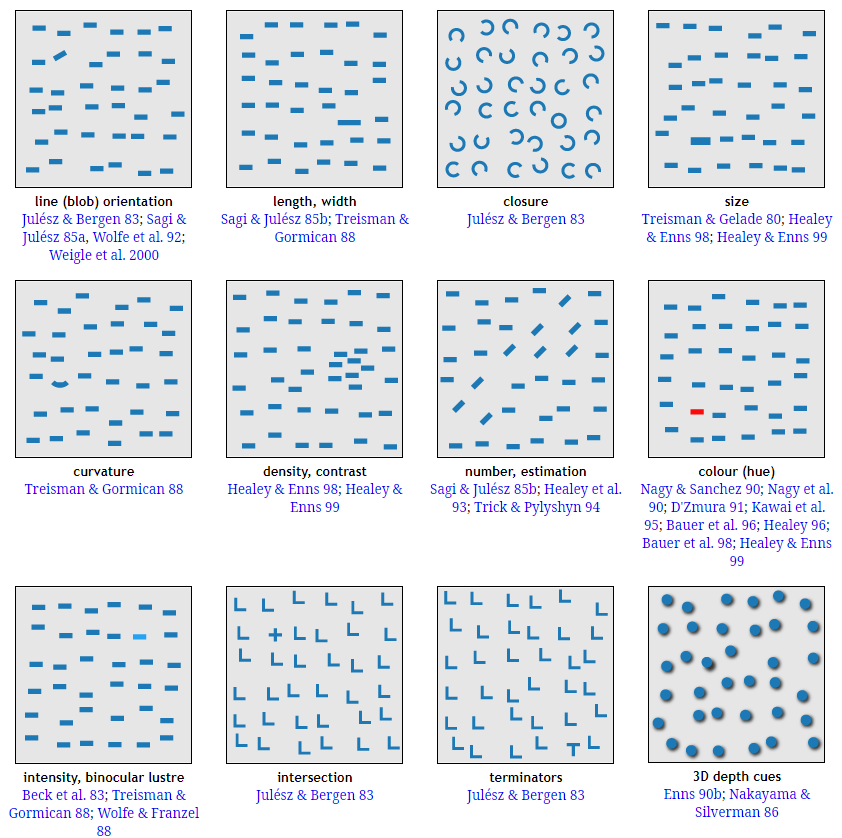{.width="80%"}

## Perception pré-attentive

:::{.question}
Comment les éléments sont-ils regroupés ?
:::

::: columns
::: {.column width="50%"}

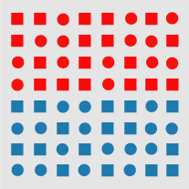

:::
::: {.column width="50%"}

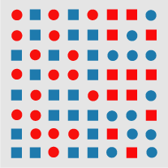

:::
:::

## Principes de Gestalt

Notre vision tend à regrouper certaines informations selon certains paramètres

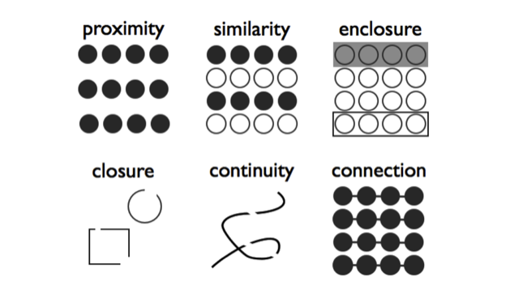


# Choix de représentations

## Principes

La création d’une visualisation est guidée par différents principes:

- Principe d’[utilité]{.heavy-red}
- Principe de [dimensionnalité]{.heavy-red}
- Principe d’[expressivité]{.heavy-red}
- Principe d’[intégrité]{.heavy-red}
- Principe d’[efficacité]{.heavy-red}


## Principe d’utilité

On utilise une visualisation lorsque c’est nécessaire

- Souvent pour travailler avec des données présentant un certain degré de complexité

```{r echo=FALSE}
library(ggplot2)
# Données simples
data <- data.frame(
  Sexe = c("Homme", "Femme"),
  Nombre = c(1, 29)
)

# Graphique en barres
ggplot(data, aes(x = Sexe, y = Nombre, fill = Sexe)) +
  geom_col() +
  labs(
    title = "Répartition Homme/Femme dans le cours SFC1030",
    x = "Sexe",
    y = "Nombre d'étudiant.es"
  ) +
  theme_minimal() +
  theme(legend.position = "none")
```

:::{.aside}
Une image vaut mieux de 10 000 mots
:::

## Principe de dimensionnalité

Le choix d’une représentation doit être fait en fonction de la dimension d’analyse dominante

 


:::{.aside}
[@rossyTraitementLinformationDans2019]
:::


## Exemple

[](figs/napoleon.png)

## Principe d’expressivité
- Un ensemble de faits est bien exprimé dans un langage visuel si les phrases (les éléments de représentation) du langage expriment
- la totalité des faits
- uniquement les faits contenus dans les données
- Une communication est basée sur le fait que tous les participants partagent des conventions qui déterminent
- Comment construire le message
- Comment interpréter le message
- Tim Bollé | SFC1018 - Méthode d'analyse - Exploiter
- Mackinlay  J (1986)
- Rossy et al. (2019)

## Monosémie
- « Un système est monosémique quand la connaissance de la signification de chaque signe précède l’observation de l’assemblage des signes »
- Besoin de lever les ambiguïtés
- Documentation des sources
- Fiabilité: Auteur, version, date/lieu de création/modification
- Validité: Sources des données
- Sur la représentation
- Titre: simple et informatif
- Légende: données, sources, définir les conventions
- Échelles
- Repères: conventions visuelles
- Tim Bollé | SFC1018 - Méthode d'analyse - Exploiter
- Bertin J (2005)
- Quentin Rossy – Cours ADSR – UNIL/ESC

## Variables visuelles
- Marques – Les briques de base de la visualisation
- Tim Bollé | SFC1018 - Méthode d'analyse - Exploiter
- Munzner T (2014)

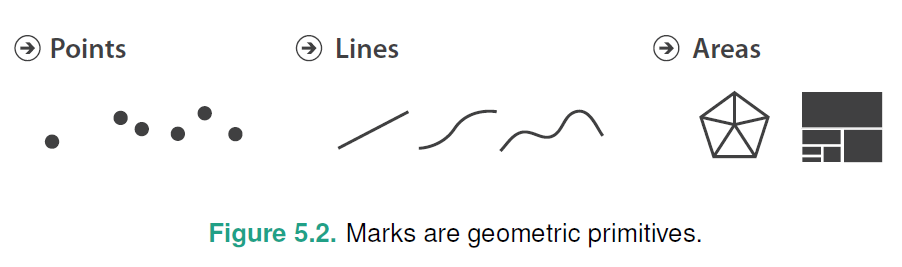


## Variables visuelles
- Channels – Organisation et apparence des marques
- Tim Bollé | SFC1018 - Méthode d'analyse - Exploiter
- Munzner T (2014)

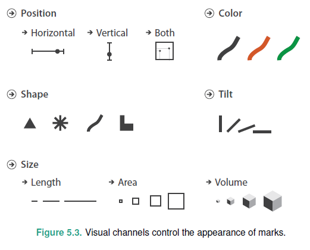


## Variables visuelles
- Tim Bollé | SFC1018 - Méthode d'analyse - Exploiter
- Bertin J (2005)

## Choix des variables
- Tim Bollé | SFC1018 - Méthode d'analyse - Exploiter
- Munzner T (2014)

## Choix des variables
- Tim Bollé | SFC1018 - Méthode d'analyse - Exploiter
- Fekete J-D (2011)

## Choix des variables
- Tim Bollé | SFC1018 - Méthode d'analyse - Exploiter
- Munzner T (2014)

## Exemple
- Tim Bollé | SFC1018 - Méthode d'analyse - Exploiter
- Farooq A (2012)

## Choix des couleurs
- Tim Bollé | SFC1018 - Méthode d'analyse - Exploiter
- Munzner T (2014)
- On utilise des color maps
- Choix de la plage de couleur va dépendre de ce que l’on souhaite représenter
- Attention avec les couleurs…
- Certaines personnes sont daltoniennes
- 8% des hommes – 1% des femmes

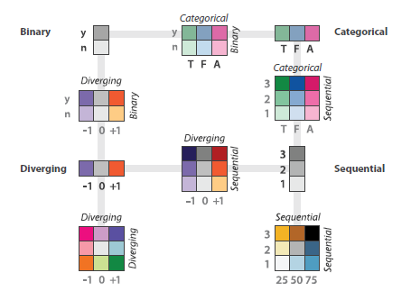


## Exemple
- Tim Bollé | SFC1018 - Méthode d'analyse - Exploiter
- Berry C (2021)

## Principe d’efficacité
- « Si, pour obtenir une réponse correcte et complète à une question donnée et toutes choses égales, une construction requiert un temps de perception plus court qu’une autre construction, on dira qu’elle est plus efficace pour cette question. »
- Tim Bollé | SFC1018 - Méthode d'analyse - Exploiter
- Bertin J (2005)
- Rossy et al. (2019)

## Exemple
- Tim Bollé | SFC1018 - Méthode d'analyse - Exploiter
- Bateman S et al. (2010)
- Tufte ER (2001)

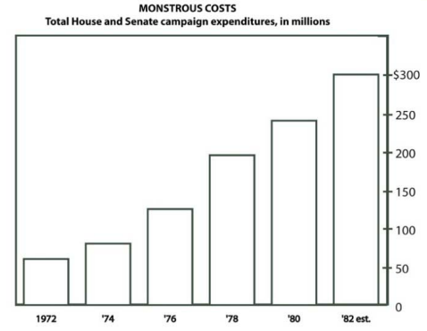


## Exemple
- Tim Bollé | SFC1018 - Méthode d'analyse - Exploiter
- Bateman S et al. (2010)
- Tufte ER (2001)

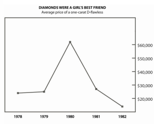


## Chartjunk – intérêt
- Résultats de l’étude de Bateman et al. (2010)
- Ne semble pas y avoir de problème d’interprétation
- Permet de se souvenir plus longtemps de la visualisation (sujet et détails)
- Pros
- Agréable, attire l’œil, plus d’impact
- Cons
- Lisibilité, sérieux
- Tim Bollé | SFC1018 - Méthode d'analyse - Exploiter

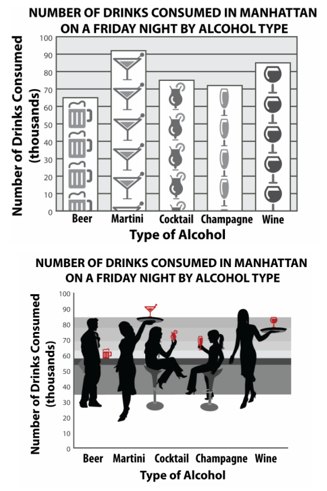


## Principe d’intégrité
- Tim Bollé | SFC1018 - Méthode d'analyse - Exploiter
- Tufte ER (2001)
- Rossy et al. (2019)

## Exemples - Distorsions
- Tim Bollé | SFC1018 - Méthode d'analyse - Exploiter
- Tufte ER (2001)

## Exemples - Décontextualisation
- Tim Bollé | SFC1018 - Méthode d'analyse - Exploiter

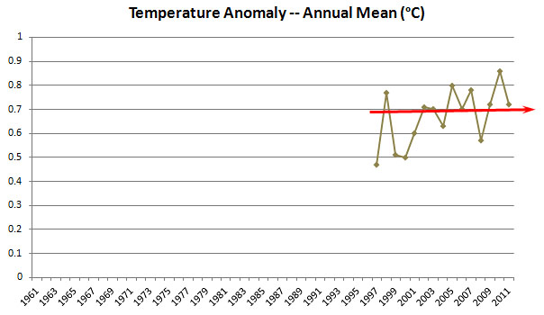


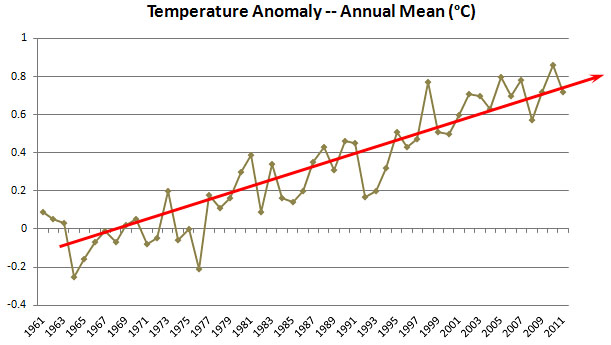


## Exemples – Changement d’échelle
- Tim Bollé | SFC1018 - Méthode d'analyse - Exploiter

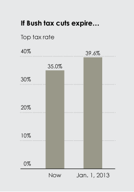


## Exemples – Changement d’échelle
- Tim Bollé | SFC1018 - Méthode d'analyse - Exploiter

## Exemple – 3D
- Tim Bollé | SFC1018 - Méthode d'analyse - Exploiter
- Berry C (2021)

## Exemple – 3D
- Tim Bollé | SFC1018 - Méthode d'analyse - Exploiter

## Exemple – Pie Chart
- Tim Bollé | SFC1018 - Méthode d'analyse - Exploiter
- https://www.storytellingwithdata.com/blog/2011/07/death-to-pie-charts

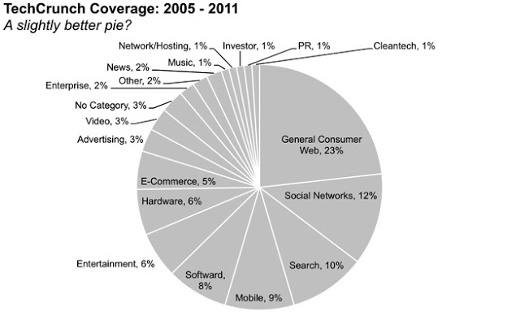


## Exemple – Pie Chart
- Tim Bollé | SFC1018 - Méthode d'analyse - Exploiter
- https://www.storytellingwithdata.com/blog/2011/07/death-to-pie-charts

## Exemple – Pie Chart
- Tim Bollé | SFC1018 - Méthode d'analyse - Exploiter
- Better pie charts:https://blog.datawrapper.de/pie-charts/

## Exemple – Line chart
- Tim Bollé | SFC1018 - Méthode d'analyse - Exploiter
- Exemple tiré du cours Data Visualization – Kirell Benzi - EPFL

## Exemple – Line chart
- Tim Bollé | SFC1018 - Méthode d'analyse - Exploiter
- Exemple tiré du cours Data Visualization – Kirell Benzi - EPFL
- Bonnes pratiques
- Axe à 0
- Pas plus de 4 lignes
- Trait plein
- Mettre les labels directement sur les lignes

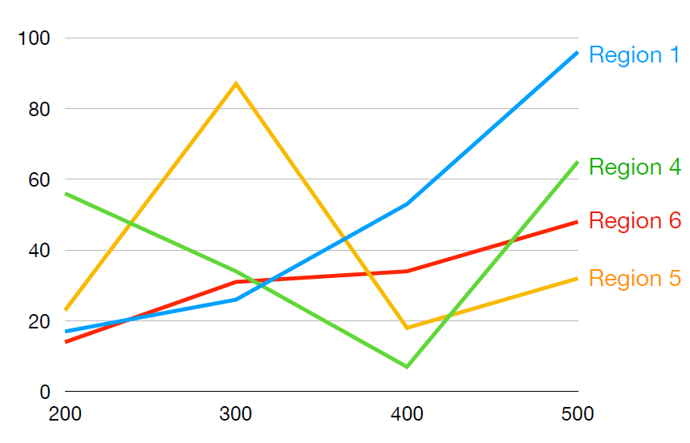


## Exercice
- Tim Bollé | SFC1018 - Méthode d'analyse - Exploiter

## Exercice
- Tim Bollé | SFC1018 - Méthode d'analyse - Exploiter

## Exercice
- Tim Bollé | SFC1018 - Méthode d'analyse - Exploiter

## Exercice
- Tim Bollé | SFC1018 - Méthode d'analyse - Exploiter

## Exercice
- Tim Bollé | SFC1018 - Méthode d'analyse - Exploiter

## Références
- Tim Bollé | SFC1018 - Méthode d'analyse - Exploiter
- Quelques galeries:
- http://euclid.psych.yorku.ca/SCS/Gallery/noframes.html
- https://www.visual-literacy.org/periodic_table/periodic_table.html
- https://r-graph-gallery.com/
- https://d3js.org/
- https://d3-graph-gallery.com/


## Références
- Munzner T (2014) Visualization Analysis and Design. New York: A K Peters/CRC Press. DOI : 10.1201/b17511.
- Bertin J (2005) Sémiologie graphique: les diagrammes - les réseaux - les cartes. 4e éd. Ré-impression. Paris: École des Hautes Études en Sciences Sociales (1967 – 1ère éd).
- Tufte ER (2001) The Visual Display of Quantitative Information. 2e édition. Cheshire, Conn: Graphics Press.
- Healey CG (s. d.) Perception in Visualization. Disponible à l’adresse : https://www.csc2.ncsu.edu/faculty/healey/PP/ [Consulté le 20 février 2023].
- Stevens SS (1946) On the Theory of Scales of Measurement. Science 103(2684). American Association for the Advancement of Science: 677‑680. DOI : 10.1126/science.103.2684.677.
- Mackinlay J (1986) Automating the design of graphical presentations of relational information. ACM Transactions on Graphics 5(2): 110‑141. DOI : 10.1145/22949.22950.
- Fekete J-D (2011) La visualisation analytique, pour comprendre des données complexes. Disponible à l’adresse : https://interstices.info/la-visualisation-analytique-pour-comprendre-des-donnees-complexes/ [Consulté le 21 février 2023].
- Farooq A (2012) A Thousand Words. Disponible à l’adresse : http://www.softviscollection.org/intro/a-thousand-words/ [Consulté le 21 février 2023].
- Rossy Q, Ribaux O, Boivin R et Fortin F (2019) Le traitement de l’information dans l’enquête criminelle. In: Cusson M, Ribaux O, Blais É, et al. (éds) Nouveau traité de sécurité: sécurité intérieure et sécurité urbaine. Nouvelle édition. Montréal: Hurtubise, p. 428‑447.
- Bateman S, Mandryk RL, Gutwin C, Genest A, McDine D et Brooks C (2010) Useful junk? the effects of visual embellishment on comprehension and memorability of charts. In: Proceedings of the SIGCHI Conference on Human Factors in Computing Systems, New York, NY, USA, 10 avril 2010, p. 2573‑2582. CHI ’10. Association for Computing Machinery. DOI : 10.1145/1753326.1753716.
- Berry C (2021) When Data Visualization Really Isn’t Useful (and When It Is) - Old Street Solutions. Disponible à l’adresse : https://www.oldstreetsolutions.com/good-and-bad-data-visualization [Consulté le 22 février 2023].
- Tim Bollé | SFC1018 - Méthode d'analyse - Exploiter
