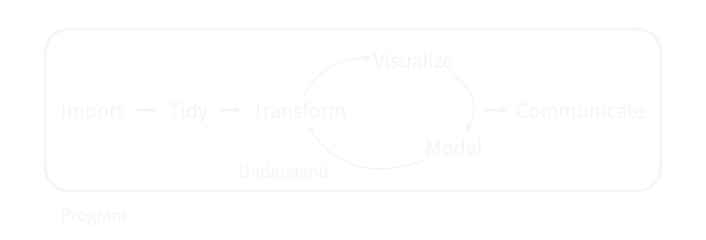
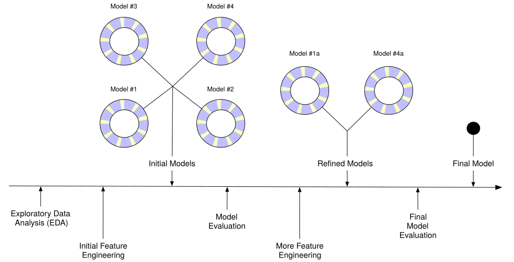
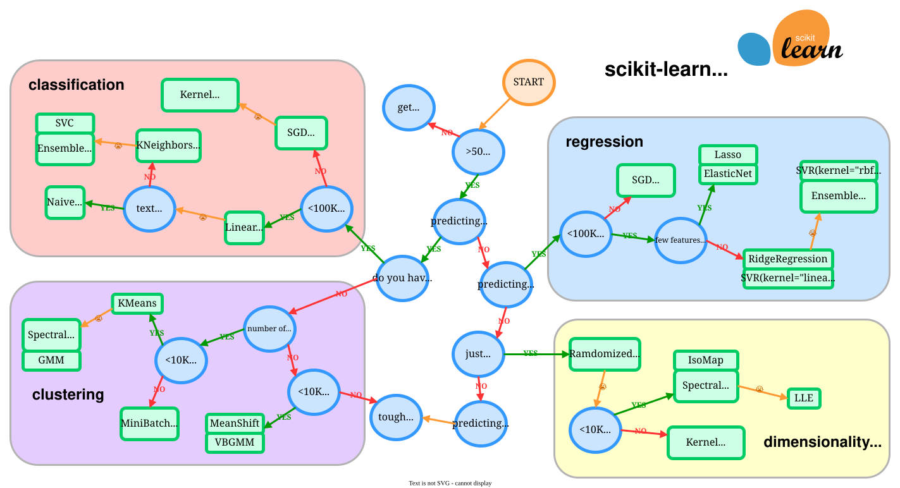
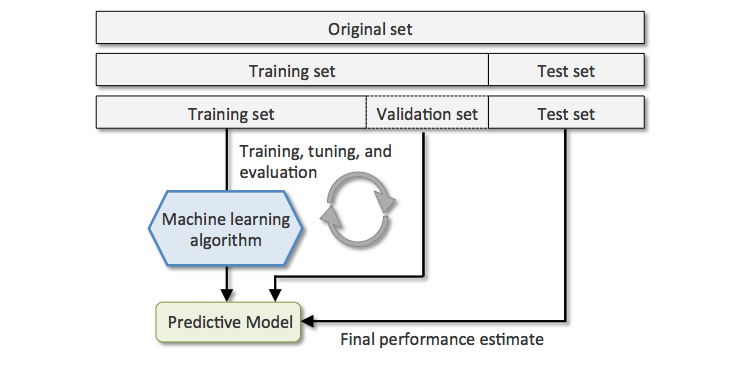
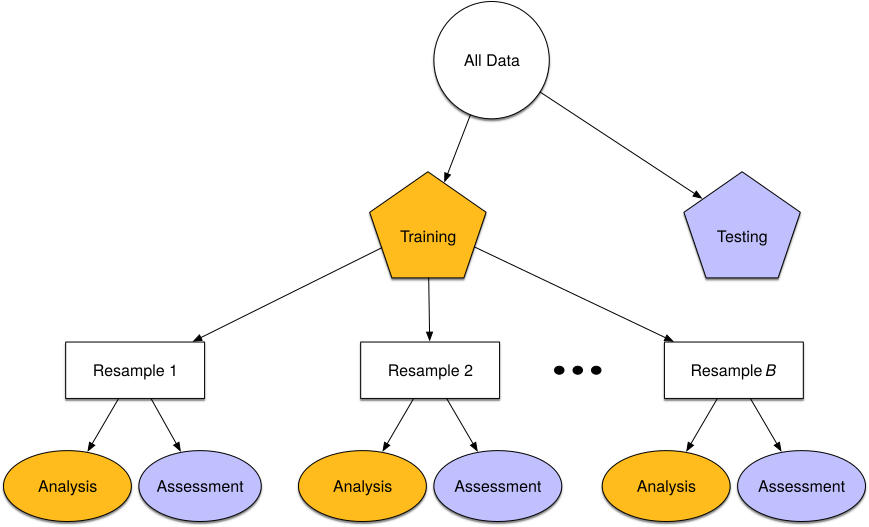

```{r packages, echo=FALSE, message=FALSE, warning=FALSE}
library(tidyverse)
library(tidymodels) # for the rsample package, along with the rest of tidymodels
library(lubridate)
library(kableExtra)

set.seed(123)
```

# Modélisation

## Modélisation

Intervient dans le processus d'analyse de données



Le machine learning permet notamment de prédire des valeurs et prendre des décisions.

## Processus de modélisation

  - **Exploratory data analysis (EDA)**: Comprendre les données, se poser des questions
  - **Feature engineering**: Créer de nouvelles variables à partir des données ou sélectionner les variables les plus pertinentes
  - **Sélection de modèle et tuning**: Choisir le modèle le plus adapté et ajuster les hyperparamètres
  - **Évaluation du modèle**: Mesurer la performance du modèle

## Processus de modélisation

{style="background-color: #FFFFFF"}

## Choix du modèle

  - [**Supervised learning**]{.heavy-red}: On a des données étiquetées
    - Classification
    - Régression
  - [**Unsupervised learning**]{.heavy-red}: On a des données non étiquetées
    - Clustering
    - Réduction de dimension
  - ...

## Choix du modèle



  
## Modàlisation et tidyverse

[Tidymodel]{.heavy-red} est un ensemble de packages qui permettent de faire du machine learning avec le tidyverse.

On retrouve les packages:

  - `parsnip`: Interface pour les modèles
  - `dials`: Sélection d'hyperparamètres
  - `tune`: Tuning des hyperparamètres
  - `workflow`: Workflows pour les modèles
  - `yardstick`: Métriques de performance
  - `recipes`: Préparation des données

# Données du jour

## `nycflights13`

Le package `nycflights13` contient des données sur les vols au départ de New York en 2013.

```{r}
set.seed(123)
library(nycflights13)

flight_data <- 
  flights %>% 
  mutate(
    # On change le retard en facteur
    arr_delay = ifelse(arr_delay >= 30, "late", "on_time"),
    arr_delay = factor(arr_delay)
  ) %>% 
  # On ajoute les données de météo
  inner_join(weather, by = c("origin", "time_hour")) %>% 
  # On ne garde que les colonnes utiles
  select(dep_time, flight, origin, dest, air_time, distance, 
         carrier, arr_delay, time_hour, temp, wind_speed, precip) %>% 
  # On enlève les lignes avec des données manquantes
  na.omit() %>% 
  # Pour faire des modèles, on préfère avoir des facteurs que du texte
  mutate_if(is.character, as.factor) %>%
  sample_n(size = 1000) # Pour que ça aille vite...
```

## Données

```{r}
flight_data %>% sample_n(size = 5)
```


# Feature engineering

## Késako ?

Le feature engineering (ou ingénierie des caractéristiques) est le processus de création, de transformation et de sélection des variables (features) utilisées pour entraîner un modèle de machine learning.

L'idée est de préparer les données de manière à améliorer la performance du modèle.

## Une première approche : `mutate()`

```{r}
flight_data %>%
  mutate(
    # Nous aurons besoin de la date
    date = lubridate::as_date(time_hour),
    dow  = wday(date),
    month = month(date)
  ) %>%
  select(-time_hour) %>%
  sample_n(size = 5) %>%
  select(date, dow, month)
```


## Feitures engineering avec `recipes`

`tidymodels` et son package `recipes` permettent de créer des recettes pour préparer les données. Cela permet de transformer certaines variables, de créer de nouvelles variables, etc.

Nous allons chercher à prédire le retard en fonction de différentes variables

## Séparation des données

```{r}
data_split <- initial_split(flight_data, prop = 3/4)

train_data <- training(data_split)
test_data  <- testing(data_split)
```


## Recettes

Une recette de base prend une **formule** et des **données**

```{r}
flights_rec <- recipe(
  arr_delay ~ ., 
  data = train_data) 
```

Par défaut, toutes les variables sont des `predictors`.

```{r}
summary(flights_rec)
```

## Recettes

Nous pouvons maintenant appliquer des transformations sur les colonnes pour créer des variables adaptées à notre modèle.

Il existe de nombreuses recettes dans le package `recipes`. Elles ont toute la forme `step_X()` où `X` sera le nom d'une recette. La liste des recettes est disponible [ici](https://recipes.tidymodels.org/reference/index.html)

Par exemple, la recette `step_date` permet de transformer une date en une autre variable (jour de la semaine, mois, années, ...)


```{r}
flights_rec <- flights_rec %>%
  step_date(time_hour, features = c("dow", "month")) %>%
  step_rm(time_hour) # On enlève la colonne originale
```

## Résultat

```{r}
prep(flights_rec) %>% 
  juice() %>%
  sample_n(size = 5) %>%
  select(starts_with("time_hour")) # Pour voir le résultat
```

## Recettes

Nous allons transformer les variables de différentes manières:

  - `update_role`: Pour indiquer les variables que l'on veut garder comme identifiant (`ID`)
  - `step_multate`: Pour créer de nouvelles variables comme un mutate normal
  - `step_date`: Pour transformer la date en variables plus utiles
  - `step_holiday`: Pour indiquer si une date tombe un jour férié
  - `step_dummy`: Pour transformer les variables catégorielles en variables binaires
  - `step_rm`: Pour supprimer des colonnes
  - `step_zv`: Pour supprimer les variables avec une variance nulle

## Recettes

```{r}
flights_rec <- recipe(arr_delay ~ ., data = train_data) %>% 
  update_role(flight, time_hour, new_role = "ID") %>%
  step_mutate(date = lubridate::as_date(time_hour)) %>%
  step_rm(time_hour) %>%
  step_date(date, features = c("dow", "month")) %>%               
  step_holiday(date, 
               holidays = timeDate::listHolidays("US"), 
               keep_original_cols = FALSE) %>%
  step_cut(temp,
           breaks = 32) %>% # On crée des catégories de température
  step_dummy(all_nominal_predictors()) %>%
  step_zv(all_predictors()) # On enlève les variables avec une variance nulle
```


# Workflow


## Faire un `workflow`

Un `workflow` est une combinaison d'une recette et d'un modèle. Il permet d'enchainer différentes opérations.

Commençons par définir un modèle: 

```{r}
lr_mod <- 
  logistic_reg() %>% 
  set_engine("glm")
```

## `workflow`

Nous pouvons maintenant combiner notre recette et notre modèle pour créer un `workflow`.

```{r}
flights_wf <- 
  workflow() %>% 
  add_recipe(flights_rec) %>% 
  add_model(lr_mod)
```

```{r echo=FALSE}
flights_wf
```


## Entrainer un `workflow`
  
Nous pouvons ensuite entraîner notre modèle. Pour cela, nous pouvons directement utiliser la fonction `fit` du `workflow`.

```{r}
flights_fit <- 
  flights_wf %>% 
  fit(data = train_data)
```


## Faire les prédictions

```{r}
flight_pred <- predict(flights_fit, test_data) %>%
  bind_cols(test_data %>% select(arr_delay))
```

```{r echo=FALSE}
flight_pred %>% sample_n(size = 5)
```

## Évaluation du modèle

:::columns
:::column
```{r roc-curve, eval=FALSE}
predict(flights_fit, test_data, type = "prob") %>%
  bind_cols(test_data %>% select(arr_delay)) %>%
  roc_curve(truth = arr_delay, `.pred_late`) %>%
  autoplot()
```
:::
:::column
```{r ref.label="roc-curve", echo=FALSE}
```
:::
:::


## Évaluation du modèle

:::columns
:::column
```{r roc-auc}
predict(flights_fit, test_data, type = "prob") %>%
  bind_cols(test_data %>% select(arr_delay)) %>%
  roc_auc(truth = arr_delay, `.pred_late`)
```
:::
:::column
```{r ref.label="roc-curve", echo=FALSE}
```
:::
:::


# Rééchantillonnage et Cross-validation

## Problème...

Comment peut-on paramétrer notre modèle pour qu'il soit le plus performant possible, sachant que nous ne voulons pas toucher aux données de test ?

## Évaluer la performance sur les données d'entraînement

:::columns
:::column
Sur les [données d'entraînement]{.heavy-red}:
```{r}
predict(flights_fit, train_data, type = "prob") %>%
  bind_cols(train_data %>% select(arr_delay)) %>%
  roc_auc(truth = arr_delay, `.pred_late`)
```
:::
:::column
Sur les [données de test]{.heavy-red}:
```{r}
predict(flights_fit, test_data, type = "prob") %>%
  bind_cols(test_data %>% select(arr_delay)) %>%
  roc_auc(truth = arr_delay, `.pred_late`)
```
:::
:::

## Évaluer la performance sur les données d'entraînement

:::columns
:::column
Sur les [données d'entraînement]{.heavy-red}:
```{r}
predict(flights_fit, train_data, type = "prob") %>%
  bind_cols(train_data %>% select(arr_delay)) %>%
  roc_curve(truth = arr_delay, `.pred_late`) %>%
  autoplot()
```
:::
:::column
Sur les [données de test]{.heavy-red}:
```{r}
predict(flights_fit, test_data, type = "prob") %>%
  bind_cols(test_data %>% select(arr_delay)) %>%
  roc_curve(truth = arr_delay, `.pred_late`) %>%
  autoplot()
```
:::
:::

## Conclusion

Le modèle d'entrainement n'est pas représentatif de la performance réelle du modèle.

Faire des prédictions sur les données d'entraînement reflète seulement ce que le modèle connait déjà.

## Première idée : Jeu de validation



## Rééchantillonnage

Pour obtenir une meilleure estimation de la performance du modèle, on peut utiliser le rééchantillonnage.

{style="background-color: #FDFDE1"}

## Rééchantillonnage

Il existe plusieurs méthodes de rééchantillonnage:

  - Validation croisée
  - Bootstrap
  - Leave-one-out
  - ...
  
Nous allons utiliser la validation croisée.


## Validation croisée


## Validation croisée

```{r}
folds <- vfold_cv(train_data, v = 5)
folds
```

## Rééchantillonnage

Nous pouvons alors entraîner notre modèle sur les différents _folds_.

```{r}
cv_fit <- lr_mod %>% 
  fit_resamples(arr_delay ~ ., 
                resamples = folds)

collect_metrics(cv_fit)
```

Nous voyons que les performances sont assez similaires à celles obtenues avec les données de test !

## Détails dans les métriques

```{r}
collect_metrics(cv_fit, summarize = FALSE)
```

## Détails dans les métriques


```{r echo=FALSE}
collect_metrics(cv_fit, summarize = FALSE) %>%
  select(id, .metric, .estimate) %>%
  pivot_wider(names_from = .metric, values_from = .estimate) %>%
  kable(col.names = c("Fold", "Accuracy", "ROC AUC", "Brier Class"), digits = 3)
```


## Références
:::{#refs}
:::