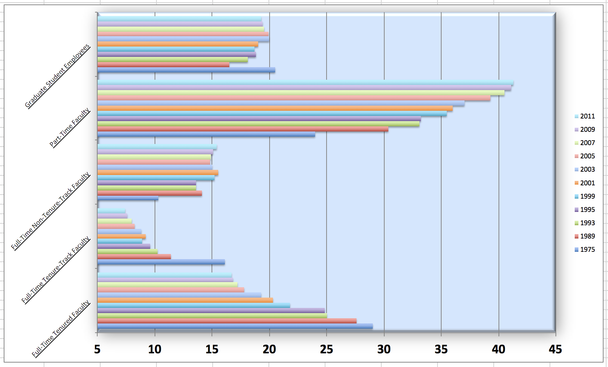
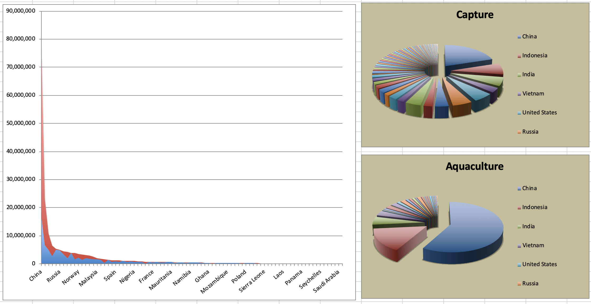

```{r setup, include = FALSE}
knitr::opts_chunk$set(eval = TRUE)
```


Le but de ce laboratoire est de pratiquer l'amélioration de visualisations.

# Pour commencer

Nous allons utiliser GitHub Classroom pour que vous puissiez rendre vos réponses.
Sur le portail de cours, vous trouverez un lien vers un assignment.

  - Cliquez sur le lien
  - Connectez vous avec votre compte Github si ce n'est pas fait
  - Acceptez l'assignment
  - Liez votre compte avec votre nom d'étudiant
  
Vous devriez maintenant voir un repository appelé `Lab06-[votre-username]` où devrait être votre nom d'utilisateur GitHub.

Sur la page du repository:

  - Cliquez sur le bouton vert: {.inline-image}
  - Copiez le lien terminant en `.git`
    - Quelque chose ressemblant à `https://github.com/PRO1036/lab06-[votre-username].git`

Dans RStudio:

-   Fichier \> Nouveau Projet
-   Version Control \> Git
-   Dans *Repository URL* : indiquez l'adresse copiée à l'étape précédente
-   Choisissez un nom pour le dossier qui sera créé, par exemple "Lab02"
-   Choisissez où vous voulez créer le projet dans votre ordinateur.

Cela va copier les fichiers présents sur GitHub, et les copier dans le dossier spécifié.
Dans le *YAML*, le `output` est réglé sur `"github_document"`. Cela permet d'obtenir un format adapté à GitHub. Notamment, votre fichier final sera un fichier Markdown (`.md`).

## Packages

Nous utiliserons le package **tidyverse** pour une grande partie de la manipulation des données.
Vous pouvez le charger en exécutant ce qui suit dans votre Console :

```{r eval = TRUE, message = FALSE}
library(tidyverse) 
```

## Données

Les données que nous utiliserons pour les différents exercices sont fournies dans le dossier `data/`.

# Exercices

## Le Brexit : Bonne ou Mauvaise idée ?

In September 2019, YouGov survey asked 1,639 GB adults the following question:

En septembre 2019, YouGov a interrogé 1 639 adultes britanniques avec la question suivante:

> In hindsight, do you think Britain was right/wrong to vote to leave EU?
>
> -   Right to leave\
> -   Wrong to leave\
> -   Don't know

C'est-à-dire:

> Avec le recul, pensez-vous que la Grande-Bretagne a eu raison/tort de voter pour quitter l'UE ?
>
> -   A eu raison de partir\
> -   A eu tort de partir\
> -   Ne sais pas

Les données de l'enquête se trouvent dans `data/brexit.csv`.


```{r}
#| message: false

brexit <- read_csv("data/brexit.csv")
```

Comme d'habitude, commencez par examiner les données.

Ensuite nous allons créer un premier graphe pour représenter les résultats de cette enquête.

```{r echo= FALSE, fig.fullwidth = TRUE}
ggplot(brexit, aes(x = region)) +
  geom_bar()
```

### Exercise 1

Pour améliorer cette visualisation nous allons commencer par changer l'ordre des catégories. Ici, elles sont ordonnées alphabétiquement. Nous allons les ordonner de la plus grande à la plus petite.

Utilisez la fonction appropriée pour réordonner les catégories de la variable `region` dans l'ordre suivant : `london`, `rest_of_south`, `midlands_wales`, `north`, `scot`. Assurez-vous d'avoir des étiquettes lisibles pour les axes et les catégories.

Vous devez obtenir quelque chose comme ceci:

```{r echo= FALSE}
brexit <- brexit %>%
  mutate(
    region = fct_recode(
      region,
      London = "london",
      `Rest of South` = "rest_of_south",
      `Midlands / Wales` = "midlands_wales",
      North = "north",
      Scotland = "scot"
    )
  )

ggplot(brexit, aes(x = region)) +
  geom_bar()
```

### Exercise 2

La lecture n'est pas évidente. Lorsque les catégories ont des noms longs, il est préférable de faire pivoter le graphique pour que les étiquettes soient horizontales.

Reproduisez le graphique ci-dessus, mais avec les barres horizontales. Assurez vous que la première catégorie soit en haut et que les étiquettes soient adaptées.

```{r echo= FALSE}
ggplot(brexit, aes(y = fct_rev(region))) +
  geom_bar() +
  labs(
    x = "Count",
    y = "Region"
  )
```

### Exercise 3

Nous allons maintenant voir quelle proportion de personnes dans chaque région pense que la Grande-Bretagne a eu raison ou tort de quitter l'UE.

Commencez par créer un graphique en barres empilées qui montre la proportion de chaque réponse dans chaque région.

```{r echo= FALSE}
ggplot(brexit, aes(y = region, fill = opinion)) +
  geom_bar()
```

Est-ce lisible ? Quelle serait une alternative ?

Essayez d'utiliser des facettes maintenant :

```{r echo=FALSE}
ggplot(brexit, aes(y = opinion, fill = region)) +
  geom_bar() +
  facet_wrap(~region, nrow = 1)
```

Voyez-vous de la redondance dans le graphe proposé ?

Comment pourrions nous l'éviter ?

### Exercice 4

La redondance peut avoir son intérêt. 

Reproduisez le graphe suivant.

```{r echo=FALSE}
ggplot(brexit, aes(y = opinion, fill = opinion)) +
  geom_bar() +
  facet_wrap(~region, nrow = 1) +
  guides(fill = "none")
```

Ici, il y a en effet de la redondance avec la couleur pour les catégories mais il n'y en a pas dans la légende !

Nettoyer les labels et autres de telle sorte à obtenir le graphique suivant:

```{r echo=FALSE}
ggplot(brexit, aes(y = opinion, fill = opinion)) +
  geom_bar() +
  facet_wrap(~region,
    nrow = 1,
    labeller = label_wrap_gen(width = 12)
  ) + 
  guides(fill = "none") +
  labs(
    title = "Was Britain right/wrong to vote to leave EU?",
    subtitle = "YouGov Survey Results, 2-3 September 2019",
    x = NULL, y = NULL
  )
```

Pour régler l'espacement dans les facettes, utilisez l'option `labeller = label_wrap_gen(width = XX)` où `XX` est un nombre définissant la largeur maximale autorisée.

### Exercice 5

Pour terminer, nous allons régler les couleurs !

Visitez le site <https://colorbrewer2.org> et choisissez une palette de couleurs adaptée pour représenter les opinions. Réflechissez notamment au type : sequentiel vs divergent vs qualitatif !

Appliquez cette palette à votre graphique.

Pour cela, utilisez la fonction `scale_fill_manual(values = c(...))` où vous devez indiquer les couleurs choisies dans le vecteur `c(...)`. Par exemple `c("Wrong" = "#000000", ...)`, où `#000000` est le code hexadécimal de la couleur noire.

Vous pouvez également essayer d'ajouter la fonction `theme_minimal()` pour changer le thème du graphique.

Au final, vous devriez obtenir quelque chose comme ceci:

```{r echo=FALSE}
ggplot(brexit, aes(y = opinion, fill = opinion)) +
  geom_bar() +
  facet_wrap(~region, nrow = 1, labeller = label_wrap_gen(width = 12)) +
  guides(fill = "none") +
  labs(title = "Was Britain right/wrong to vote to leave EU?",
       subtitle = "YouGov Survey Results, 2-3 September 2019",
       x = NULL, y = NULL) +
  scale_fill_manual(values = c("Wrong" = "#ef8a62",
                               "Right" = "#67a9cf",
                               "Don't know" = "gray")) +
  theme_minimal()
```


## Les tendances de l'emploi du personnel d'enseignement

L'association américaine des professeurs d'université (AAUP) est une association à but non lucratif composée de professeurs et d'autres professionnels du milieu universitaire. [Ce rapport](https://www.aaup.org/sites/default/files/files/AAUP_Report_InstrStaff-75-11_apr2013.pdf) compilé par l'AAUP montre les tendances des employés du personnel d'enseignement entre 1975 et 2011, et contient une image très similaire à celle donnée ci-dessous.

```{r echo=FALSE, fig.fullwidth = TRUE}

```

Commençons par charger les données utilisées pour créer ce graphique.

```{r load-data-staff, message = FALSE}
staff <- read_csv("data/instructional-staff.csv")
```

Chaque ligne de cet ensemble de données représente un type de personnel enseignant, et les colonnes sont les années pour lesquelles nous disposons de données. Les valeurs sont le pourcentage d'embauches de ce type de personnel pour chaque année.

```{r echo = FALSE}
staff
```

### Exercise 1

Pour reproduire cette visualisation, nous devons d'abord remodeler les données pour avoir une variable pour le type de personnel enseignant et une variable pour l'année. En d'autres termes, nous allons convertir les données du format large au format long.

Avant de faire cela, un exercice de réflexion : *Combien de lignes le format long aura-t-il ?*

À l'aide de la fonction appropriée, convertissez les données du format large au format long et enregistrez le résultat dans une nouvelle variable appelée `staff_long`.


```{r echo= FALSE}
staff_long <- staff %>%
  pivot_longer(cols = -faculty_type, names_to = "year") %>%
  mutate(year = as.numeric(year))
```

Voilà ce que vous devriez avoir :

```{r}
staff_long
```


### Exercise 2

Quelles dimensions souhaite-t-on représenter dans le graphique ? De quelle type sont-elles (quantitative, qualitative, ...) ?

Selon vous, quel type de graphique serait le plus approprié pour représenter ces données ?

### Exercise 3

Commencez par reproduire un graphe en barres comme celui présent dans le rapport de l'AAUP.

Comment pouvez-vous améliorer ce graphique ? Pensez à des aspects tels que la lisibilité, les couleurs, les étiquettes, le titre, etc.

### Exercise 4

Proposez un autre type de graphe plus adapté pour représenter ces données.


Une possibilité est présentée ci-dessous :

```{r fig.width = 10, fig.fullwidth = TRUE}
staff_long %>%
  ggplot(aes(x = year, y = value, color = faculty_type)) +
  geom_line()
```

Reproduisez ce graphique ou proposez-en un autre. Proposez des améliorations en prenant en compte le message important de ce graphe.

🧶 ✅ ⬆️ 
*Knit, commit, and push ! N'oubliez pas le message de commit.*


## Pêcheries

Le département des pêcheries et de l'aquaculture de l'Organisation des Nations Unies pour l'alimentation et l'agriculture collecte des données sur la production halieutique des pays. [Cette page Wikipedia](https://en.wikipedia.org/wiki/Fishing_industry_by_country) répertorie la production halieutique des pays pour 2016. Pour chaque pays, le tonnage de la capture et de l'aquaculture est indiqué. Notez que les pays dont la récolte totale était inférieure à 100 000 tonnes ne sont pas inclus dans la visualisation.

Un chercheur vous a partagé la visualisation suivante qu'il a créée à partir de ces données.
😳

```{r echo=FALSE, fig.fullwidth = TRUE}

```

### Exercise 5

Pouvez-vous l'aider à améliorer cette visualisation ? Quelles sont les principales lacunes de cette visualisation ?


### Exercise 6

Vous pouvez charger les données avec le code suivant :

```{r load-data-fisheries, eval = FALSE}
fisheries <- read_csv("data/fisheries.csv")
```

Essayez de répondre aux problèmes que vous avez identifiés dans l'exercice précédent en créant une nouvelle visualisation des données.


🧶 ✅ ⬆️ 
*Knit, commit, and push ! N'oubliez pas le message de commit.*


# Plus de mauvais exemples

Vous en voulauez plus ? Voici quelques ressources supplémentaires avec des exemples de mauvaises visualisations :

-   [Flowing Data - Ugly Charts](https://flowingdata.com/category/visualization/ugly-visualization/)
-   [Reddit - Data is ugly](https://www.reddit.com/r/dataisugly/)
-   [Missed Opportunities and Graphical Failures](http://www.datavis.ca/gallery/missed.php)
-   [(Mostly Bad) Graphics and Tables](http://users.stat.umn.edu/~rend0020/Teaching/STAT8801-resources/graphics/index.html)